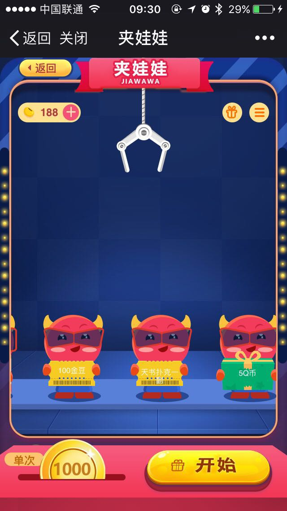

# vue-jww [VUE夹娃娃游戏](https://game.niu.xunlei.com/dfw/jww.html)

> A Vue.js project, use Vue, Vue-router, Vuex

## 抓娃娃说明



每个娃娃的 `li` 为 `98`, 本体为 `70`
娃娃的个数 x 2 x 2 x 3/4

## Build Setup

``` bash
# install dependencies
npm install

# serve with hot reload at localhost:8080
npm run dev

# build for production with minification
npm run build

# build for production and view the bundle analyzer report
npm run build --report
```

For detailed explanation on how things work, checkout the [guide](http://vuejs-templates.github.io/webpack/) and [docs for vue-loader](http://vuejs.github.io/vue-loader).


